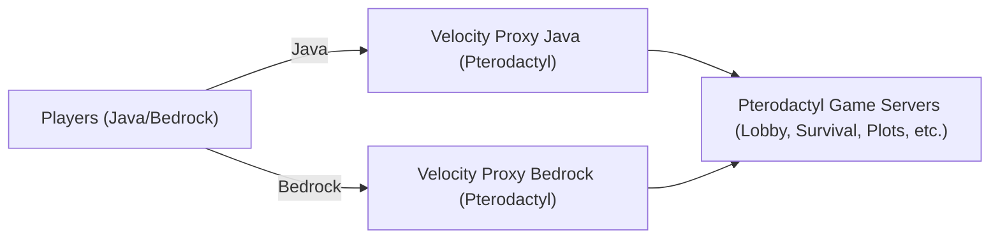

# SumerCraft - Architecture Overview

## Objective
Establish a robust Minecraft network where Java and Bedrock players can connect, using a hybrid architecture for flexibility, stability, and ease of management.

## Hybrid Architecture

This project now uses **Pterodactyl** to manage all services, including Velocity proxies for both Java and Bedrock editions. All infrastructure is orchestrated through Pterodactyl for unified management and automation.

### Why this architecture?

- **Stability**: Proxy is always available, independent of the game panel.
- **Community support**: Game servers are managed with Pterodactyl, a widely adopted solution.
- **Scalability**: New servers or services can be added modularly.

## General Structure

## Main Components

### Proxies
- **Velocity Java**: Proxy for Java Edition players.
- **Velocity Bedrock**: Proxy for Bedrock Edition players, kept updated to the latest Bedrock-supported Velocity version.

### Game Servers
- All Minecraft servers (Lobby, Survival, Plots, etc.).
- Multi-user, backup, and resource management features.

## Networking
All services (proxies and game servers) are managed and networked through Pterodactyl, ensuring seamless communication and unified orchestration.

## User Flow
1. Player connects (Java or Bedrock)
2. Velocity Proxy handles authentication and routing
3. Player enters the lobby or selected game server (managed by Pterodactyl)
4. Player activity and logs can be monitored (future implementation)

## Key Features
- Java and Bedrock support (separate Velocity proxies for each)
- Unified management of proxies and servers via Pterodactyl
- Modular and scalable architecture
- Resilient infrastructure (all services managed in one panel)

## Scalability
- Add new game servers or proxy instances easily.
- Easily update Velocity Bedrock to the latest supported version as needed.
- Add new nodes by installing Wings and connecting to the panel.

## Server Requirements
- Minimum: 4 CPU cores, 16 GB RAM, 100 GB SSD
- Recommended: 8 CPU cores, 32 GB RAM, 500 GB SSD

## Current Server Hardware (single host)
- **CPU**: Intel Xeon-D 1520 (4c/8t, 2.2/2.6 GHz)
- **RAM**: 32 GB ECC 2133 MHz
- **Storage**: 2×480 GB SSD SATA (software RAID)

## Installation Overview
1. Prepare the server (install Docker, Docker Compose, dependencies)
2. Install Pterodactyl Panel and Wings
3. Configure Wings to use the shared Docker network
4. Deploy infrastructure services with Docker Compose
5. Add and manage game servers

---
This document provides a high-level overview of the SumerCraft architecture, focusing on simplicity and modularity. Docker Compose is now only used to deploy the Panel and Wings; all Velocity proxies and Minecraft servers are managed directly by Pterodactyl.
